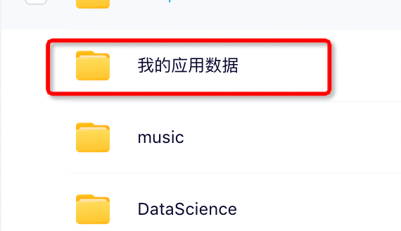

这里主要给 [bypy-命令行下使用百度网盘](https://zhuanlan.zhihu.com/p/348483516)
做一点补充。
这里这个CLI其实是写死了一个工作路径，这个对应网盘里/app/bypy

但是有个比较坑的是，再根目录，显示的是中文alias "我的应用数据"， 这让大家使用时候根本找不对路径。

所以，需要把要下载的东西放在这个路径下面，然后 bypy list 就可以看到了。